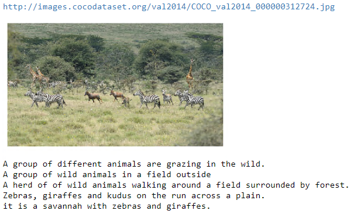
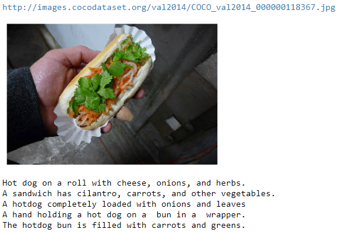

# Image Captioning Project

## Exploring the dataset

This project builds on the Microsoft **C**ommon **O**bjects in **CO**ntext (MS COCO) dataset The dataset is commonly used to train and benchmark object detection, segmentation, and captioning algorithms.  


You can read more about the dataset on the [website](http://cocodataset.org/#home) or in the [research paper](https://arxiv.org/pdf/1405.0312.pdf).


## Step 1: Initialize the COCO API

We begin by initializing the [COCO API](https://github.com/cocodataset/cocoapi) that you will use to obtain the data. This project builds on the train2014 dataset. It’s provides sufficient data for our model to generalize. Later, the model is evaluated on the val2014 and test2014 dataset.

## Step 2: Plot a Sample Image

Next, we plot a random image from the dataset, along with its five corresponding captions.  Each time you run the code cell below, a different image is selected.  

In the project, you will use this dataset to train your own model to generate captions from images!






Above are three examples of training data in our dataset. As we can see, each image is pared with 5 captioning written by different people. The captionings are **not necessarily** of the same length and they have different focuses of the image.

Out **Objective** is to devise a neural network that takes an image an **input**, and generate a **caption** that reasonably describe the input image.

The **architecture** of our model is described as below:


We have a <span style="color:cyan">**CNN**</span>-<span style="color:green">**RNN**</span>encoder-decoder architecture where the <span style="color:cyan">**CNN**</span> encodes the image into a <span style="color:red">**feature_vector of a fixed size (embed_size)**</span>. The decoder (<span style="color:green">**RNN**</span>) receives the feature_vector and generates a sequence of words that described the content in the input image.

The above image demonstrate the end-to-end training process of the model where the image feed to the model and it’s output are compared with the ground-truth captioning to compute loss. Details of the architecture are discussed in model.py file.

## Step 3: Explanations of details in data_loader and model.py


We use [data loader](http://pytorch.org/docs/master/data.html#torch.utils.data.DataLoader) to load the COCO dataset in batches. 

In the code cell below, you will initialize the data loader by using the `get_loader` function in **data_loader.py**.  

> The **data_loader.py** is in a separate file that contains all these detail.

The `get_loader` function takes as input a number of arguments that can be explored in **data_loader.py**.  Take the time to explore these arguments now by opening **data_loader.py** in a new window.  Most of the arguments must be left at their default values, and you are only allowed to amend the values of the arguments below:
1. **`transform`** - an [image transform](http://pytorch.org/docs/master/torchvision/transforms.html) specifying how to pre-process the images and convert them to PyTorch tensors before using them as input to the CNN encoder.  We can choose our own image transform to pre-process the COCO images.
2. **`mode`** - one of `'train'` (loads the training data in batches) or `'test'` (for the test data). We will say that the data loader is in training or test mode, respectively.  While following the instructions in this notebook, please keep the data loader in training mode by setting `mode='train'`.
3. **`batch_size`** - determines the batch size.  When training the model, this is number of image-caption pairs used to amend the model weights in each training step. Typically, we start with a batch_size of 32 and increase or decrease empirically.
4. **`vocab_threshold`** - the total number of times that a word must appear in the in the training captions before it is used as part of the vocabulary.  Words that have fewer than `vocab_threshold` occurrences in the training captions are considered unknown words. 
5. **`vocab_from_file`** - a Boolean that decides whether to load the vocabulary from file.  

We will describe the `vocab_threshold` and `vocab_from_file` arguments in more detail soon.  

Once we have specified the above variables, we can create our `data_loader` from COCO training dataset. **NOTE THAT:** the `vocab_threshold` parameters we have specified will influence vocabulary we obtain from the dataset. Basically, we will label all words that have appear **less than `vocab_threshold`** as <unk_word>


### Exploring the `__getitem__` Method

The data loader was stored in the variable `data_loader`.  

We can access the corresponding dataset as `data_loader.dataset`.  This dataset is an instance of the `CoCoDataset` class in **data_loader.py**.  If you are unfamiliar with data loaders and datasets, you are encouraged to review [this PyTorch tutorial](http://pytorch.org/tutorials/beginner/data_loading_tutorial.html).

The `__getitem__` method in the `CoCoDataset` class determines how an image-caption pair is pre-processed before being incorporated into a batch.  This is true for all `Dataset` classes in PyTorch; if this is unfamiliar to you, please review [the tutorial linked above](http://pytorch.org/tutorials/beginner/data_loading_tutorial.html). 

When the data loader is in training mode, this method begins by first obtaining the filename (`path`) of a training image and its corresponding caption (`caption`).

#### Image Pre-Processing 

Image pre-processing is relatively straightforward (from the `__getitem__` method in the `CoCoDataset` class):
```python
# Convert image to tensor and pre-process using transform
image = Image.open(os.path.join(self.img_folder, path)).convert('RGB')
image = self.transform(image)
```
After loading the image in the training folder with name `path`, the image is pre-processed using the same transform (`transform_train`) that was supplied when instantiating the data loader.  

#### Caption Pre-Processing 

The captions also need to be pre-processed and prepped for training. In this example, for generating captions, we are aiming to create a model that predicts the next token of a sentence from previous tokens, so we turn the caption associated with any image into a list of tokenized words, before casting it to a PyTorch tensor that we can use to train the network.

To understand in more detail how COCO captions are pre-processed, we'll first need to take a look at the `vocab` instance variable of the `CoCoDataset` class.  The code snippet below is pulled from the `__init__` method of the `CoCoDataset` class:
```python
def __init__(self, transform, mode, batch_size, vocab_threshold, vocab_file, start_word, 
        end_word, unk_word, annotations_file, vocab_from_file, img_folder):
        ...
        self.vocab = Vocabulary(vocab_threshold, vocab_file, start_word,
            end_word, unk_word, annotations_file, vocab_from_file)
        ...
```
From the code snippet above, you can see that `data_loader.dataset.vocab` is an instance of the `Vocabulary` class from **vocabulary.py**.  Take the time now to verify this for yourself by looking at the full code in **data_loader.py**.  

We use this instance to pre-process the COCO captions (from the `__getitem__` method in the `CoCoDataset` class):

```python
# Convert caption to tensor of word ids.
tokens = nltk.tokenize.word_tokenize(str(caption).lower())   # line 1
caption = []                                                 # line 2
caption.append(self.vocab(self.vocab.start_word))            # line 3
caption.extend([self.vocab(token) for token in tokens])      # line 4
caption.append(self.vocab(self.vocab.end_word))              # line 5
caption = torch.Tensor(caption).long()                       # line 6
```

Every caption is added a special start word: `<start> ` and a special end word: `<end>`. So a sentence like: ‘A person doing a trick on a rail while riding a skateboard’ will be tokenized as: [0, 3, 98, 754, 3, 396, 39, 3, 1009, 207, 139, 3, 753, 18, 1] where 0 stands for `<start>` and 1 stands for `<end>`.

During prediction, when we receive a `<end>` from the model, it would also mean we terminate producing captioning.

Finally, this list is converted to a PyTorch tensor.  All of the captions in the COCO dataset are pre-processed using this same procedure from **`lines 1-6`** described above.  

As you saw, in order to convert a token to its corresponding integer, we call `data_loader.dataset.vocab` as a function.  The details of how this call works can be explored in the `__call__` method in the `Vocabulary` class in **vocabulary.py**.  

```python
def __call__(self, word):
    if not word in self.word2idx:
        return self.word2idx[self.unk_word]
    return self.word2idx[word]
```

The `word2idx` instance variable is a Python [dictionary](https://docs.python.org/3/tutorial/datastructures.html#dictionaries) that is indexed by string-valued keys (mostly tokens obtained from training captions).  For each key, the corresponding value is the integer that the token is mapped to in the pre-processing step.

### Batching in the Data_Loader

The captions in the dataset vary greatly in length. We can examining using `data_loader.dataset.caption_lengths`. The majority of them are around 10, and there are captions that go up to 50+ length.


To generate batches of training data, we begin by first sampling a caption length (where the probability that any length is drawn is proportional to the number of captions with that length in the dataset).  Then, we retrieve a batch of size `batch_size` of image-caption pairs, where all captions have the sampled length.  This approach for assembling batches matches the procedure in [this paper](https://arxiv.org/pdf/1502.03044.pdf) and has been shown to be computationally efficient without degrading performance.

Run the code cell below to generate a batch.  The `get_train_indices` method in the `CoCoDataset` class first samples a caption length, and then samples `batch_size` indices corresponding to training data points with captions of that length.  These indices are stored below in `indices`.

These indices are supplied to the data loader, which then is used to retrieve the corresponding data points.  The pre-processed images and captions in the batch are stored in `images` and `captions`.

## Model architecture

### EncoderCNN

For Encoder we used the ResNet50 model pre-trained from image-nets. More powerful model can be applied here. However, ResNet50 performs reasonably well with a decent amount of training. We would freeze all the weights in the pre-trained model and remove its output layer. The removed output layer is replaced with our own Linear layer that takes in the number of output features and produce a feature of size: embedding size. Therefore, it is important that when creating an instance of our EncoderCNN model we make sure to take in parameter embed_size to specify our network sufficiently.


The Encoder takes in an image of (224,224,3) and produce an feature vector of (embed_size).

### DecoderRNN

The decoder is a simple LSTM architecture with dropout for regularization. When specifying out decoder, make sure we have the correct vocab_size which is determined when we decide our vocab_threshold and construct our Vocabulary. It is also important to imbed our target captions using nn.Embedding() first before feeding into our network.

Notice that we have input length of (`1+len(captions)`), the “1” comes from our image feature vector. Therefore, for the hidden state of LSTM we only take `hiddens[:,:-1,:]` so that the lengths match. The structure is demonstrated below:


Things we need to decide when creating instances of our network: `embed_size` from the input image, `hidden_size` for the DecoderRNN,  `vocab_size` from the vocabulary we created earlier and the number of layers for our LSTM.

## Traininggit 

Now, we start training in the `Training.ipynb` file.

Important parameters that effects the training of our network:
- `batch_size` - the batch size of each training batch.  It is the number of image-caption pairs used to amend the model weights in each training step. 
- `vocab_threshold` - the minimum word count threshold.  Note that a larger threshold will result in a smaller vocabulary, whereas a smaller threshold will include rarer words and result in a larger vocabulary.  
- `vocab_from_file` - a Boolean that decides whether to load the vocabulary from file. 
- `embed_size` - the dimensionality of the image and word embeddings.  
- `hidden_size` - the number of features in the hidden state of the RNN decoder.  
- `num_epochs` - the number of epochs to train the model.  We recommend that you set `num_epochs=3`, but feel free to increase or decrease this number as you wish.  [This paper](https://arxiv.org/pdf/1502.03044.pdf) trained a captioning model on a single state-of-the-art GPU for 3 days, but you'll soon see that you can get reasonable results in a matter of a few hours!  (_But of course, if you want your model to compete with current research, you will have to train for much longer._)
- `save_every` - determines how often to save the model weights.  We recommend that you set `save_every=1`, to save the model weights after each epoch.  This way, after the `i`th epoch, the encoder and decoder weights will be saved in the `models/` folder as `encoder-i.pkl` and `decoder-i.pkl`, respectively.
- `print_every` - determines how often to print the batch loss to the Jupyter notebook while training.  Note that you **will not** observe a monotonic decrease in the loss function while training - this is perfectly fine and completely expected!  You are encouraged to keep this at its default value of `100` to avoid clogging the notebook, but feel free to change it.
- `log_file` - the name of the text file containing - for every step - how the loss and perplexity evolved during training.

We applied [`nn.CrossEntropuLoss()`](<https://pytorch.org/docs/stable/nn.html>) in this case to compute our loss.  [Adam optimizer](<https://pytorch.org/docs/stable/_modules/torch/optim/adam.html>) are used for optimization with learning rate of 0.0001. The neural network is trained for 3 Epochs. The loss is initialized to be 9.3 and drops to around 4. There is a lot of potential of improving the training such as using adaptive learning rate, applying a different optimizer or simply spend more time in training.